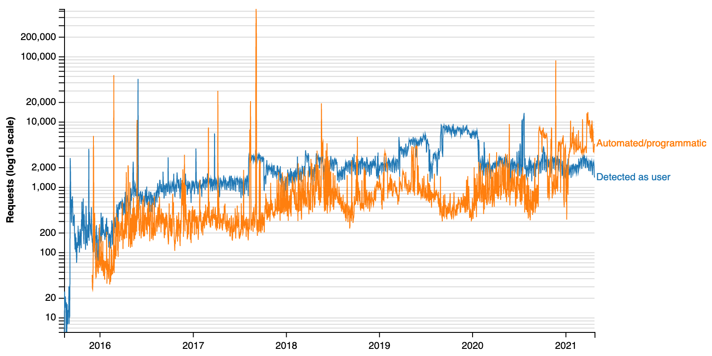

# Wikimania 2021 Hackathon

Supporting code &amp; docs for [User:MPopov (WMF)](https://meta.wikimedia.org/wiki/User:MPopov_(WMF))'s (aka [User:Bearloga](https://meta.wikimedia.org/wiki/User:Bearloga)) [Wikimania 2021 Hackathon](https://wikimania.wikimedia.org/wiki/2021:Hackathon) project to make a replacement data visualization of Wikidata Query Service usage as part of [Phab:T227782](https://phabricator.wikimedia.org/T227782).

## Data

Datasets created with [scripts/data.R](data.R) and uploaded to Wikimedia Commons:
- [Data:Sandbox/MPopov (WMF)/WDQS homepage traffic.tab](https://commons.wikimedia.org/wiki/Data:Sandbox/MPopov_(WMF)/WDQS_homepage_traffic.tab)
- [Data:Sandbox/MPopov (WMF)/WDQS SPARQL endpoint.tab](https://commons.wikimedia.org/wiki/Data:Sandbox/MPopov_(WMF)/WDQS_SPARQL_endpoint.tab)
- [Data:Sandbox/MPopov (WMF)/WDQS LDF endpoint.tab](https://commons.wikimedia.org/wiki/Data:Sandbox/MPopov_(WMF)/WDQS_LDF_endpoint.tab)

## Graphs

The graphs like the demo above are created using Vega 2 and displayed on-wiki with the `<graph mode=interactive>…</graph>` tags containing the following JSON specifications:
- [Homepage traffic](graphs/homepage_traffic.json)
- [SPARQL endpoint](graphs/sparql_endpoint.json)
- [LDF endpoint](graphs/ldf_endpoint.json)

They can be found at [mw:User:MPopov (WMF)/Wikimania 2021 Hackathon](https://www.mediawiki.org/wiki/User:MPopov_(WMF)/Wikimania_2021_Hackathon)

## Links

- [mw:Extension:Graph](https://www.mediawiki.org/wiki/Extension:Graph)
    - [External data](https://www.mediawiki.org/wiki/Extension:Graph/Guide#External_data)
    - [Graph Sandbox](https://www.mediawiki.org/wiki/Special:GraphSandbox)
- [mw:Help:Tabular Data](https://www.mediawiki.org/wiki/Help:Tabular_Data)
